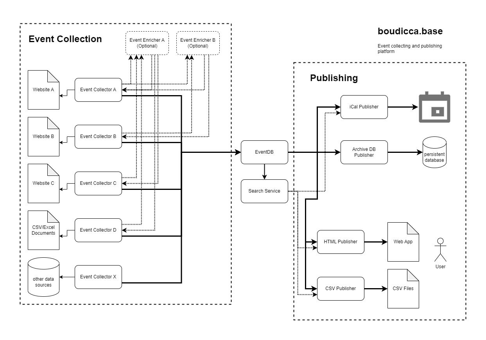

# Architecture

This repo contains two codebases
 - boudicca.base - contains all services which can be used independently to create a new service based upon boudicca platform
 - boudicca.events - this is the code which is specific to the [boudicca.events](https://boudicca.events) page

## boudicca.base

There are three big groups of services interacting to make boudicca.events work:

### EventCollectors

The EventCollectors job is to gather event data, enrich them by calling the Enrichers, and then send them to the EventDB.

#### Enrichers

Enrichers, as their name suggests, can be used by event collectors to enrich their event information. For example there
could be a central database of locations with accessibility data or additional information like geo coordinates etc.

Another use case might be to look up the artists of an event in an online database and link it.

Enrichers can optionally be used to extract repeating lookup tasks out from collectors.

### The Core

Our core boudicca system currently consists of two services:

#### EventDB

The EventDB which job it is to accept new event data from collectors, persist them and provide them for other
services to consume. 

#### Search Service 

The Search service is a service which provides search functionality on the EventDB data and is mostly used by the publishers.

### Publishers

Publishers are services which make the data of boudicca.events accessible to users. This can take many forms, for
example our website is the so-called html-publisher. There can be other publishers as well, for different mediums, for
different formats as ical, RSS, PDF, ... or for different purposes (prefiltered event data for only music, ... for
example)
